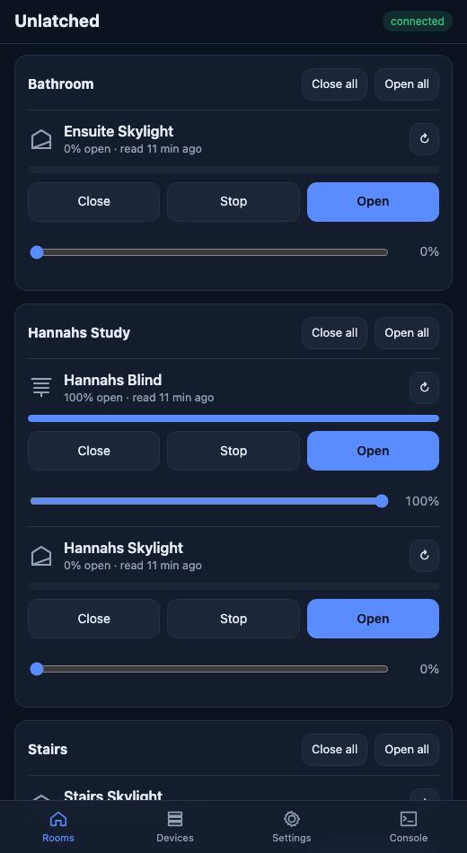
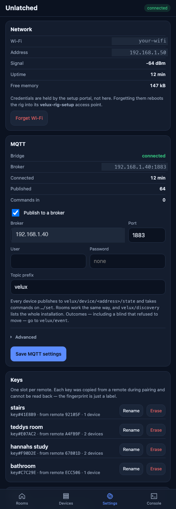
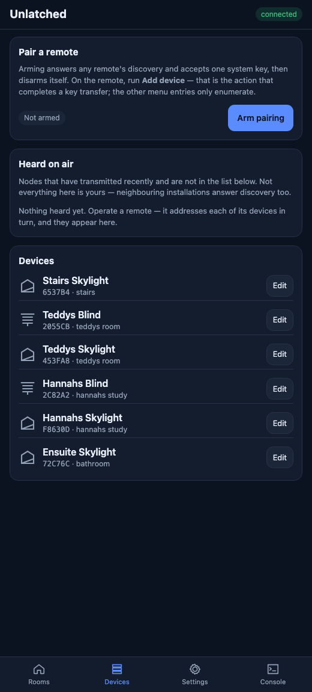
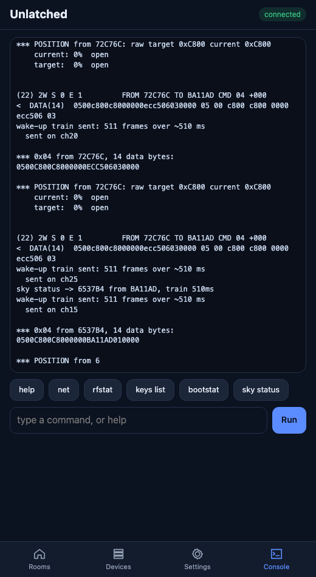

# Getting started

Unlatched puts io-homecontrol skylights and blinds on your own network, with a
phone-friendly web page and an MQTT bridge, on about $10 of hardware. No cloud,
no gateway, no subscription.

**io-homecontrol** is the wireless protocol behind Velux, Somfy and a number of
other European window and shading brands. All open-source projects currently
target FSK on the **868 MHz** band, which is where it runs in Europe — and 868 MHz
is a European allocation. Gear sold into **Australia, New Zealand and North
America** runs on **2.4 GHz** instead, using 802.15.4 O-QPSK on channels 15, 20
and 25. 

The radio is different, the modulation is different, and the frames are wrapped
differently on the way out. Unlatched is a port of that earlier work to a 2.4 GHz
variant, same protocol above the link layer, an entirely different radio underneath.

It was built to drive my **Velux skylights and blinds in AU** and should work
elsewhere.

This guide takes you from a bare board to opening a window from your phone.

---

## Contents

1. [What you need](#1-what-you-need)
2. [Wiring](#2-wiring)
3. [Flashing](#3-flashing) — [prebuilt binary](#option-a--flash-a-prebuilt-binary) or [from source](#option-b--build-from-source)
4. [Joining your Wi-Fi](#4-joining-your-wi-fi)
5. [Settings, including MQTT](#5-settings-including-mqtt)
6. [Pairing a KLR 200 remote](#6-pairing-a-klr-200-remote)
7. [Controlling your windows](#7-controlling-your-windows)
8. [Updating over the air](#8-updating-over-the-air)
9. [When something goes wrong](#9-when-something-goes-wrong)

---

## 1. What you need

| Item | Notes |
| --- | --- |
| Seeed XIAO ESP32-C6 | The only board this firmware supports |
| AT86RF231 2.4 GHz module | As the esp32c6 does not support sending frames using a custom SFD, this one does and closely matches the radio in the KLF200. [I used this module from Aliexpress](https://www.aliexpress.com/item/1005009110521049.html)  |
| Nine jumper wires | Or a small perfboard |
| USB-C cable | **Data**, not charge-only — a charge-only cable is the single most common "my board won't appear" |
| A KLR 200 remote | Already paired with the windows you want to control |


---

## 2. Wiring

| RF231 pad | XIAO pad | GPIO |
| --- | --- | --- |
| 1/2 VCC | 3V3 | — |
| 1/2 GND | GND | — |
| 3 SLP_TR | D2 | 2 |
| 4 /RST | D1 | 1 |
| 5 SCLK | D8 | 19 |
| 6 MISO | D9 | 20 |
| 7 MOSI | D10 | 18 |
| 8 /SEL | D3 | 21 |
| 9 IRQ | D0 | 0 |

> **3.3 V only.** 

---

## 3. Flashing

### Install the tools

<details open>
<summary><b>macOS</b></summary>

```bash
brew install python
```

```bash
python3 -m pip install --user esptool platformio
```
</details>

<details>
<summary><b>Ubuntu / Debian</b></summary>

```bash
sudo apt update && sudo apt install -y python3-pip python3-venv git
```

```bash
python3 -m pip install --user esptool platformio
```

Add yourself to the serial group, then **log out and back in**:

```bash
sudo usermod -a -G dialout $USER
```
</details>

<details>
<summary><b>Windows</b></summary>

Install Python 3 from [python.org](https://www.python.org/downloads/), ticking
**Add Python to PATH**, then in PowerShell:

```powershell
py -m pip install --user esptool platformio
```
</details>

### Find the serial port

Plug the board in with a data cable.

| OS | Command | Looks like |
| --- | --- | --- |
| macOS | `ls /dev/cu.usbmodem*` | `/dev/cu.usbmodem101` |
| Linux | `ls /dev/ttyACM*` | `/dev/ttyACM0` |
| Windows | `mode` or Device Manager | `COM5` |

The ESP32-C6 uses native USB, so it appears as a modem/ACM device rather than a
USB-serial adapter. If nothing shows up, hold **BOOT**, tap **RESET**, release
**BOOT** to force the ROM bootloader, then look again.

### Option A — flash a prebuilt binary

Download `firmware.factory.bin` from the
[releases page](https://github.com/charlem/unlatched/releases) and write it at
offset 0. It is a merged image containing the bootloader, partition table and
application, so this one command is the whole job.

<details open>
<summary><b>macOS / Linux</b></summary>

```bash
esptool.py --chip esp32c6 --port /dev/cu.usbmodem101 --baud 921600 write_flash 0x0 firmware.factory.bin
```
</details>

<details>
<summary><b>Windows</b></summary>

```powershell
py -m esptool --chip esp32c6 --port COM5 --baud 921600 write_flash 0x0 firmware.factory.bin
```
</details>

Erasing first is rarely necessary, but if the board was previously running
something else:

```bash
esptool.py --chip esp32c6 --port /dev/cu.usbmodem101 erase_flash
```

> **Erasing also wipes settings**, including the rig's node address and its
> stored keys. On a board that is already paired, see
> [§9](#9-when-something-goes-wrong) first.

### Option B — build from source

```bash
git clone https://github.com/YOUR-ORG/unlatched.git
```

```bash
cd unlatched/firmware && pio run -e XiaoC6RF231
```

The first build downloads the toolchain and takes a few minutes; afterwards it
is seconds. The web interface is compiled into the image — there is no separate
filesystem step.

Then flash over USB:

```bash
pio run -e XiaoC6RF231 -t upload
```

PlatformIO usually finds the board itself. If you have more than one ESP32
attached, set `upload_port` in `platformio.ini` or pass
`--upload-port /dev/cu.usbmodem101`.

To watch it boot:

```bash
pio device monitor -b 115200
```

---

## 4. Joining your Wi-Fi

The rig has no Wi-Fi credentials when first flashed, so it starts its own access
point.

1. Join the network **`velux-rig-setup`**.
2. A captive portal opens. If it does not, browse to `http://192.168.4.1`.
3. Choose **Configure WiFi**, pick your network, enter the password, save.
4. The rig reboots and joins. The portal times out after three minutes, so if
   you walk away mid-setup it will simply restart and try again.

**Finding its address afterwards.** The rig prints its IP to the serial console
at boot, and announces it as `web ui up: http://.../`. If it has already been
deployed out of reach, look in your router's DHCP leases for a client named
after the ESP32. 

> mDNS is deliberately disabled, so there is no `.local` name to use. Address the
> rig by IP.

Open `http://<rig-ip>/` and you should see this:



---

## 5. Settings, including MQTT

Everything below lives on the **Settings** tab.



### MQTT

Tick **Publish to a broker**, fill in the broker address and port, and press
**Save MQTT settings**. It connects immediately — no reboot. The block above the
form then shows `connected`, along with how many messages it has published and
how many commands it has accepted.

| Field | Meaning |
| --- | --- |
| Broker / Port | Your MQTT server. `1883` is the usual plaintext port |
| User / Password | Leave blank for an anonymous broker. The password is never sent back to the page once stored |
| Topic prefix | Everything is published under this. Default `velux` |

Under **Advanced**: the client ID (blank derives one from the MAC), QoS, whether
to retain state topics, and how often to re-announce the discovery document.

Once connected, every device publishes to
`<prefix>/device/<address>/state` and accepts commands on `.../set`. Rooms work
the same way, `<prefix>/discovery` describes the whole installation, and command
outcomes — including a blind that refused to move — go to `<prefix>/event`.
The full topic map is in [README.md](README.md#mqtt).

There is no vendor-specific discovery format. Anything that speaks MQTT can read
it without being taught a schema.

### Radio settings worth knowing about

| Setting | Default | What it does |
| --- | --- | --- |
| Refresh every device's position | 900 s | These devices only report a position when asked, and the rig forgets what it knew when it restarts. Without this, everything shows **unknown** until operated |
| Move quietly by default | on | The slow travel profile, for windows driven at night |
| Read the position back after a move | 25 s | How long to wait before checking where it ended up |
| Command channel | All three | Which 802.15.4 channel to command on. Leave on all three unless you know better |
| Wake-up train | 510 ms | These actuators are low-power and hear nothing without it. Don't change this without a reason |
| Our address | derived from the MAC | What the rig transmits as. **Changing it breaks pairing** — the installation knows the rig by this |

### Access

A password is optional and off by default, with user name `velux`. It is off by
default deliberately: locking yourself out of a device that lives out of reach of
a cable is the worse failure. Every request that changes something must carry an
`X-Velux` header regardless, which is what stops a page on another site from
making your browser open the windows.

---

## 6. Pairing a KLR 200 remote

Pairing copies one **system key** from your remote. Each remote is its own
system covering its own devices, so repeat this once per remote.

The rig is armed only until a key arrives, then disarms itself — an armed rig
answers anybody's discovery, which is not a surface to leave open.

### Step 1 — Arm the rig for pairing

Open the **Devices** tab and press **Arm pairing**.



The pill next to it changes to *Armed — waiting for the remote*.

### Step 2 — On the remote, run "Add device"

On the KLR 200: **Menu → New product → Add device** (wording varies slightly by
firmware).

> **This step matters.** Other menu entries like copying a remote will not work. Only
> **Add device** completes a key transfer. If you run the wrong one you will see
> the rig notice the remote and then nothing further happen. You can safely delete the newly added Shutter device from your remote once pairing is complete.

### Step 3 — Name the key and save it

Within a few seconds the page shows **Key captured**, with the key's fingerprint
and the remote it came from. Type the room it covers — `bathroom`, `landing` —
and press **Save key**.

The name matters more than it looks: **devices with no room of their own are
grouped under the name of the key slot they belong to.** Naming a slot
`bathroom` puts its windows in a Bathroom group on the Rooms tab immediately,
and renaming the slot later moves them.

The captured key is held in memory only until you save it. **Discard** throws it
away, and getting another means running the procedure on the remote again.

### Step 4 — Let the devices appear

Devices announce themselves only when a remote talks to them, so operate the
remote once — open or close something — and its windows appear under **Heard on
air** on the Devices tab. Adopt them, then use **Edit** to give each a name and
a type.

Not everything under *Heard on air* is yours. Neighbouring installations answer
discovery too, and their addresses will show up. Adopt only the ones that react
when you drive them.

---

## 7. Controlling your windows

The **Rooms** tab is the landing page: every device grouped by room.


- **Close / Stop / Open** drive one device.
- **The slider** sends a proportional position. Percentages are **percent open** —
  100 % is fully open, 0 % fully closed.
- **↻** reads the real position back over the air.
- **Close all / Open all** on a room header drive everything in it.

Under each name you get the last known position and how long ago it was read —
`0% open · read 2 min ago`. A device that has never been read says so rather
than guessing.

**A tap returns immediately; the window does not.** Commands are queued and sent
one at a time, because each takes a 510 ms wake-up train plus up to three channel
attempts — as much as four seconds of radio. The pill at the top right shows
`sending` or `3 queued` so a tap that will not be acted on for half a minute does
not look ignored.

A device with no key bound has its movement controls disabled. It can still be
read; moving it would draw an authentication challenge the rig cannot answer.

### The Console tab

The same command parser the serial port and telnet drive, with live output above
it. `help` lists everything; `net`, `bootstat` and `keys list` are the ones you
will actually use.



---

## 8. Updating over the air

Once the rig is in place, you never need the cable again. Set the address in
`platformio.ini` under `[env:XiaoC6RF231_ota]`:

```ini
upload_port = 192.168.1.50
```

Then:

```bash
pio run -e XiaoC6RF231_ota -t upload
```

The partition table reserves two application slots. An OTA writes into the
inactive one and swaps, and if the new image fails to stay up for 60 seconds
three times running, the rig rolls back to the one that worked. That safety net
is the reason a rig in a roof is still recoverable.

---

## 9. When something goes wrong

**The board doesn't appear as a serial port.** Charge-only USB cable, nine times
out of ten. Otherwise force the bootloader: hold **BOOT**, tap **RESET**, release
**BOOT**.

**The page loads but every device says "unknown".** Normal for the first minute
after a boot — the rig reads each device in turn and populates within about a
minute. If it persists, the devices are out of range or have no key bound.

**A command does nothing.** Check the device shows a key on the Devices tab. Then
watch the Console while you tap: you should see a wake-up train, the frame going
out, and a challenge coming back. On MQTT the `event` topic gives you the same
thing as a one-line verdict — `acked`, `no-response`, `rejected`, `no-key`.

```
myaddr <the old six-hex address>
```

Write that address down somewhere now, while you know it.

---


## MQTT

The rig can publish what it knows to a broker and take commands back from one.
Off by default; fill in a broker on the Settings tab, or from the console:

```
mqtt host 192.168.1.40 1883
mqtt user velux
mqtt pass secret
mqtt on
```

`mqtt` on its own prints the connection state, and `net` includes it.

There is **no vendor discovery format here, and no product-specific topic
namespace**. What goes on the broker is this installation described plainly --
devices, the rooms they are in, where they are, and what happened when something
asked one to move. Anything that speaks MQTT can read it.

The client is ESP-IDF's own esp-mqtt, which arduino-esp32 ships precompiled.
The vendored `AsyncMqttClient-esphome` under `lib/` is still ignored in
`platformio.ini` along with AsyncTCP: those predate arduino-esp32 3.x and no
longer compile, which is the same wall the web UI hit.

### Topics

`<base>` is the configurable prefix, `velux` unless changed. `<node>` is a
six-hex-digit address, as every other interface prints it. `<room>` is a slug:
lower case with non-alphanumerics folded to `-`, so "Kids' room" is addressed
as `kids-room`.

Published, retained unless noted:

| Topic | What |
| --- | --- |
| `<base>/status` | `online` / `offline`. The offline copy is the broker's last will |
| `<base>/bridge` | rig health: address, ip, uptime, heap, queue depth |
| `<base>/discovery` | the whole inventory in one document -- see below |
| `<base>/devices` | `{"devices":[ ... ]}`, every state in one read |
| `<base>/rooms` | `{"rooms":[ ... ]}` |
| `<base>/device/<node>/state` | one device |
| `<base>/room/<room>/state` | one room |
| `<base>/event` | **not retained** -- one message per command outcome |
| `<base>/device/<node>/event` | **not retained** -- the same, per device |

Subscribed:

| Topic | What |
| --- | --- |
| `<base>/device/<node>/set` | one device |
| `<base>/room/<room>/set` | every device in that room |
| `<base>/all/set` | every device |
| `<base>/set` | several devices, named in the payload |
| `<base>/get` | republish everything from cache; costs no radio time |

**Positions are percent OPEN throughout**: 100 fully open, 0 fully closed, -1
not known. The wire protocol counts the other way and that inversion never
leaves `iohc_control.cpp`.

### Commanding

JSON, or a bare word for the common case:

```bash
mosquitto_pub -t velux/device/2055CB/set -m CLOSE
mosquitto_pub -t velux/device/2055CB/set -m 45          # a number is a position
mosquitto_pub -t velux/device/2055CB/set -m '{"action":"position","position":45}'
mosquitto_pub -t velux/device/2055CB/set -m '{"action":"status"}'   # read it over the air
mosquitto_pub -t velux/room/kitchen/set  -m OPEN
mosquitto_pub -t velux/all/set           -m STOP
```

**Travel is quiet by default.** These are bedrooms, so anything that does not
say otherwise gets the slow profile. Add `"silent":false` to ask for ordinary
speed, or turn the default off on the Settings tab; the console takes `silent`
or `loud` as a word anywhere in a `sky` line.

Several devices in one message, which is what `<base>/set` is for:

```bash
mosquitto_pub -t velux/set -m '{"devices":["2055CB","0EE9A6"],"action":"close"}'
mosquitto_pub -t velux/set -m '{"rooms":["kitchen","landing"],"position":50}'
mosquitto_pub -t velux/set -m '{"commands":[
    {"device":"2055CB","position":0},
    {"room":"kitchen","action":"close"}]}'
```

Each entry inherits anything it does not state from the document around it, so
a shared action with per-device positions does not have to repeat itself.

### Discovery

`<base>/discovery` is one retained document describing the whole installation:
every device with its name, room, type, whether it can actually be driven, and
its state if known, plus the room list and the shape of every topic above. It
goes out on connect, whenever the inventory changes, and every
`mqttDiscoveryS` seconds (five minutes by default).

It carries the topic map so that a consumer can bootstrap from this one message
without being told the scheme in advance. State in it is as of when it was
published -- the live topics are what to follow for current positions.

### Events

Every command reports what became of it, on `<base>/event` and on the device's
own event topic. `result` is what an automation branches on; `phase` is what a
person reads:

| phase | result | means |
| --- | --- | --- |
| `queued` | `pending` | accepted; the radio queue is up to four seconds per command ahead of it |
| `acked` | `ok` | the device answered -- it heard the command. `authenticated` says whether that was a challenge round (a movement) or a plain reply (a read) |
| `moving` | `pending` | a read-back found it part way there; another is queued |
| `settled` | `ok` / `failed` | it has stopped, and this is where |
| `no-response` | `failed` | nothing answered on any channel tried |
| `rejected` | `failed` | `CMD_ERROR_RESP` came back, with the reason in `detail` |
| `no-key` | `failed` | no key is bound, so the challenge could not be answered |

```json
{"node":"2055CB","name":"Kitchen blind","room":"Kitchen","action":"close",
 "result":"ok","phase":"settled","detail":"reached the requested position",
 "source":"mqtt","position":0,"target":0,"channel":20,"error":0,"uptimeS":8123}
```

`acked` is not `settled`. An acknowledgement says the command was heard; only
the read-back that follows a move says the window went anywhere. `source` names
the interface that asked -- `mqtt`, `web` or `console` -- which is worth having
when an event says a window opened and nobody in the room did it.

A move is followed until it stops, not read once. One read is not enough: these
units take about as long to travel their full range as the default read-back
delay, so a single read lands mid-travel as often as not -- a command to 25% on
this installation read back 56%, still closing. A read that finds the device
still going emits `moving` and queues another, up to four times. Only a device
that has stopped produces a verdict, so `failed` means it really did stop
somewhere else.

Events are deliberately never retained. A retained event is a past action
presented to every future subscriber as news, and the action it describes is one
where that matters.

### Out-of-band changes

A window operated from a handheld remote, rather than from the rig, still shows
up. Two things make that work:

**The receiver rotates channels while idle.** The radio is started with one scan
frequency (ch20) and iohcRadio's hopping timer is commented out, so left alone
the rig hears only ch20 -- and after a command, only whichever channel that
command ended on. The remote does not keep to one channel: an energy scan caught
it alternating ch25 with ch15 or ch20, about 500 ms per channel, with ch25
carrying roughly half the airtime. So the command worker moves the receiver
between the three channels every 400 ms whenever it has nothing to send. `net`
prints the current one, and the web API reports it as `radio.listenCh`.

It rotates from the command worker rather than a timer or a task of its own
because `Radio::` has no lock and the number of tasks that can reach it is the
standing hazard here. That task already owns the radio for transmission, already
runs above the packet decoder, and is already awake every 200 ms doing nothing.
It never moves the carrier mid-frame, and it parks on ch20 while a key handover
is armed, since that exchange was tuned with the receiver pinned there.

**Someone else's commands are read.** A `0x00` (activate / set position) from an
address that is not ours, addressed to a device that is, is taken at face value:
the target it names is recorded immediately and a read-back is queued to confirm
where the window actually stopped. The actuator also broadcasts its progress
while travelling, and those `0x04` frames are picked up passively whenever the
rig is dwelling on the right channel.

Both feed the registry, so an out-of-band change reaches MQTT and the web UI by
the same path as anything else.

**Every device is refreshed on a slow rotation** (`pollIntervalS`, 15 minutes by
default, 0 to disable), because passive listening alone is not enough to know
where anything is. These actuators volunteer nothing -- a position is known only
because something asked -- and the live state is deliberately not persisted
across a reboot, since a stored position is a guess about a window somebody may
have moved by hand. Without the sweep the rig comes back knowing where nothing
is and publishes `unknown` for the whole house until each device is operated in
turn.

The reads are spread one at a time across the interval, not swept together: each
costs a wake-up train and up to three channel attempts, so six in a row would
hold the radio for half a minute and stop it listening while it did. The first
pass after boot runs faster, so the house is populated within about a minute.
A refresh publishes no events -- it is housekeeping -- but if it catches a
device mid-travel it hands over to the tracking read, which does report where it
stopped.

### Staying out of other people's exchanges

While `pairMode` is off -- which is its normal state, and it disarms itself once
a key arrives -- the rig transmits in reply only to frames addressed to it.
`addressedToUs()` guards every responding handler. The discovery handlers are
the deliberate exception and are gated on `pairMode` instead, because a roll-call
is broadcast and answering an unaddressed frame is the whole point of it.

### On availability

There is no per-device availability topic, and that is a decision rather than an
omission. These actuators are low-power and say nothing unless asked, so silence
from one carries no information about whether it is reachable. A window reported
unavailable because nobody polled it for an hour would be worse than no signal
at all. `<base>/status` answers the question that can be answered: whether the
rig is up.

---

## Where to read next

- **`firmware/web/`** — the front end. `index.html` opens directly in a desktop
  browser for layout work; a rebuild inlines and compresses it into the image.

## Safety

This drives motorised windows in your home. They can close on things. Test with
something harmless in the way before trusting an automation, and keep the
physical remotes working — this firmware is an addition to your installation,
not a replacement for it.

---

## Credits

This project stands on work that other people did first and gave away.

**[Velocet/iown-homecontrol](https://github.com/Velocet/iown-homecontrol)** —
the reverse-engineered protocol documentation the whole lineage rests on. The
frame layout, the three CRCs, the AES variants and the challenge/response
exchange are all documented there. Released under CC0-1.0, which asks for
nothing in return; credited anyway, because without it none of this is possible.

**[CRIDP](https://github.com/cridp)** — the firmware this is forked from,
Copyright 2024–2025, Apache-2.0. It is where the io-homecontrol stack here comes
from: the packet structures, the crypto implementations, the 1W and 2W command
sequences, the pairing flow. Unlatched retargets it from 868 MHz (SX1276, FSK)
to 2.4 GHz (AT86RF231, O-QPSK) and rewrites a great deal on the way, but the
foundation is CRIDP's.

**[laberning/home_io_control](https://github.com/laberning/home_io_control)** —
Copyright 2026–present Lars Berning and contributors, MIT. Used as a reference
while working out the 2.4 GHz framing, the key-transfer procedure, the position
encoding and the silent travel profile. No code was copied from it; where its
findings informed something here, the source file says so at the point of use.

Also, with thanks: **ArduinoJson** (MIT), **WiFiManager** by tzapu (MIT), and
the **Arduino core for ESP32** and **ESP-IDF**.

Full licence terms and the record of modifications are in
[LICENSE](LICENSE) and [NOTICE](NOTICE). If you distribute binaries of this
firmware, those notices need to travel with them.

---

## Disclaimer

Unlatched is an independent open-source project. It is **not affiliated with,
endorsed by, or connected to VELUX, Somfy, or io-homecontrol**. All trademarks
are the property of their respective owners, and are used here only to describe
the hardware this software interoperates with.

The software is provided as is, without warranty of any kind. You are
responsible for how you use it on your own equipment.
